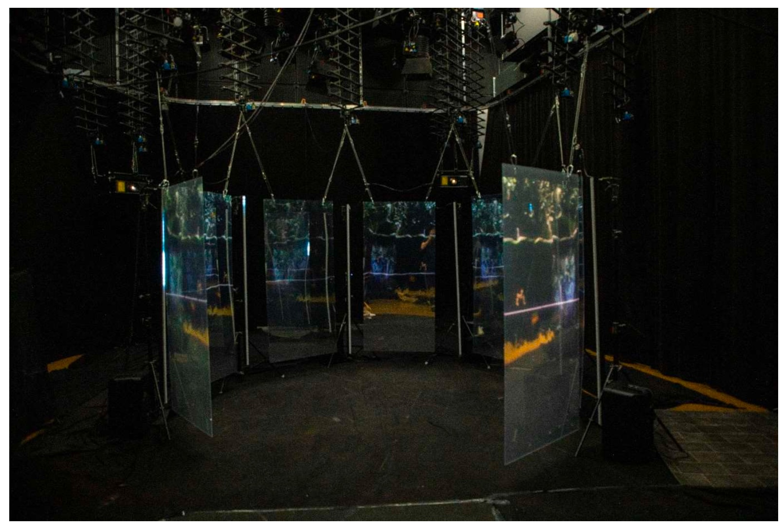

name: inverse
layout: true
class: center, middle, inverse
---

## Master Thesis Preparation Workshop

#### Prof. Dr. Lena Gieseke | l.gieseke@filmuniversitaet.de  

#### Film University Babelsberg KONRAD WOLF

---
layout: false
## Today

--
* Master Thesis Requirements

--
* Master Thesis Examples

--
* Timelines

--
* Project Values

---
## Learning Objectives

--
* Know about all requirements

--
* Have a rough plan for your timeline

--
* Know what is important to you for the thesis

--
* Know about next steps

---
template: inverse

# Master Thesis Requirements  
Master Thesis Examples  
Timelines  
Project Values  

---

## Master Thesis Requirements 

The Master Thesis consists of

--
* a practical part (1.7 SWS, 11 ECTS),

--
* a theoretical part (0.7 SWS, 16 ECTS), and

--
* a colloquium (0.1 SWS, 3 ECTS)
  
--
  
This is the common amount of work (30 ECTS) for one term 

???
.task[COMMENT:]  

* practical = 11 ECTS = 41 d = 8,25 w
* theoretical = 16 ECTS = 60 d = 12 w
=> knapp 5 monate
* colloquium = 3 ECTS = 11,25 d = 2 w

--
**including the lecture-free time**, meaning 6 months!   
  
--
  
  
You can add time to the thesis project by using ECTS from 'Creative Technologies II' of the 3rd term.   

???
.task[COMMENT:]  

* I highly recommend that and to aim for being in the very least ready to start with the thesis project right away in the 4th term. You should have a project, research questions and a schedule by the end of the 3rd term. Ideally, you also already have a prototype for the practical part or at least did some sanity checks.

---

## Master Thesis Requirements

### Advisor

* Two advisors, you a free to chose
* The primary advisor must be from the Film University
* One advisor must be from CTech 

--

> No-one is required to advise you, so ask nicely.

---

## Master Thesis Requirements

### Content

> § 6 (2) Der praktische Teil der Masterarbeit (11 LP) beinhaltet ein **Projekt, das Technologie kreativ und innovativ einsetzt und diese weiterentwickelt oder analysiert**. Es dient dem Nachweis, dass die/der Studierende befähigt ist, **moderne Technologie in einem interdisziplinären Umfeld zu konzipieren und neuartige technologisch-kreative Medienproduktionen maßgeblich zu gestalten**.

  
.footnote[[[Prüfungsordnung CTech_MA_SPO_2019]](https://www.filmuniversitaet.de/fileadmin/user_upload/pdfs/studium/STO-PO-Plaene-Module/CTech_MA_SPO_2019.pdf)]

--

*The practical part of the master's thesis includes a project that uses technology creatively and innovatively and develops or analyzes it further. It serves to demonstrate that the student is capable of conceiving modern technology in an interdisciplinary environment and significantly shaping novel technological-creative media productions.*

---

## Master Thesis Requirements

### Content

> § 6 (3) Der wissenschaftliche Teil der Masterarbeit (16 LP) soll belegen, dass die/der Studierende die Fähigkeit zum **konzeptionellen und kontextualisierenden Diskurs, zur kritischen Reflexion und zur wissenschaftlichen Arbeit** besitzt. Der **Inhalt soll sich auf den praktischen Teil der Masterarbeit beziehen**.

.footnote[[[Prüfungsordnung CTech_MA_SPO_2019]](https://www.filmuniversitaet.de/fileadmin/user_upload/pdfs/studium/STO-PO-Plaene-Module/CTech_MA_SPO_2019.pdf)]

--
The academic part of the Master's thesis should prove that the student has the ability to conceptualize and contextualize discourse, critical reflection and academic work. The content should relate to the practical part of the master thesis.

---

## Master Thesis Requirements

### Content

The practical and theoretical parts must be connected.
  
--
  
 
  
**However each part must also work on its own, with its own storyline / contribution!**

???
.task[COMMENT:]  

* E.g. the theoretical part can not just be a documentation of the practical part

---

## Master Thesis Requirements

### Content

The written part must include about the practical part at the very least:

--
* Motivation / artist statement / context

--
* Description

--
* Technical setup

--
* Reflection on the connection of academic and practical part
  
--
  
How you integrate these points is up to you.

---

## Master Thesis Requirements

### Form

> § 6 [...] (5) Der Umfang der Arbeit soll **mindestens 30** (80.000 Zeichen) und **maximal 80 Seiten** (180.000 Zeichen),
ohne Inhaltsverzeichnis und Referenzliste, betragen. Zeichen verstehen sich mit Leerzeichen und
Fußnoten. Als Layout sind die folgenden oder entsprechenden Spezifikationen zu verwenden.
Schriftart: Times New Roman. Schriftgröße: Text: 12 pt; Fußnoten: 10 pt. Zeilenabstand: Text: 1,5-
zeilig; Fußnoten: 1-zeilig. Seitenränder: links 3 cm; rechts 2 cm, oben und unten 2,5 cm. 
  

.footnote[[[Prüfungsordnung CTech_MA_SPO_2019]](https://www.filmuniversitaet.de/fileadmin/user_upload/pdfs/studium/STO-PO-Plaene-Module/CTech_MA_SPO_2019.pdf)]

---

## Master Thesis Requirements

### Form
  
§ 6 [...] (5) The thesis should be a minimum of 30 (80,000 characters) and a maximum of 80 pages (180,000 characters), excluding table of contents and reference list. Characters include spaces and footnotes. The following or equivalent specifications are to be used for the layout. Font: Times New Roman. Font size: text: 12 pt; footnotes: 10 pt. Line spacing: text: 1.5 lines; footnotes: 1 line. Margins: left 3 cm; right 2 cm, top and bottom 2.5 cm.

.footnote[[[Prüfungsordnung CTech_MA_SPO_2019]](https://www.filmuniversitaet.de/fileadmin/user_upload/pdfs/studium/STO-PO-Plaene-Module/CTech_MA_SPO_2019.pdf)]

---

## Master Thesis Requirements

### Form

>§ 6 [...] (5) Die Arbeit kann durch einen Appendix und audiovisuelle Medien ergänzt werden. Es ist in deutscher
und englischer Sprache eine Zusammenfassung von jeweils zwischen 100 und 300 Worten am Anfang
der Arbeit einzufügen. Die deutsche und englische Version sollen sich inhaltlich entsprechen. 

.footnote[[[Prüfungsordnung CTech_MA_SPO_2019]](https://www.filmuniversitaet.de/fileadmin/user_upload/pdfs/studium/STO-PO-Plaene-Module/CTech_MA_SPO_2019.pdf)]

--

The work can be supplemented by an appendix and audiovisual media. A summary of between 100 and 300 words in German and English must be included at the beginning of the thesis. The German and English versions should correspond in terms of content. 

---

## Master Thesis Requirements

### Form

>§ 6 [...] (5) Die Arbeit kann durch einen Appendix und audiovisuelle Medien ergänzt werden. Es ist in deutscher und englischer Sprache eine Zusammenfassung von jeweils zwischen 100 und 300 Worten am Anfang
der Arbeit einzufügen. Die deutsche und englische Version sollen sich inhaltlich entsprechen. 

.footnote[[[Prüfungsordnung CTech_MA_SPO_2019]](https://www.filmuniversitaet.de/fileadmin/user_upload/pdfs/studium/STO-PO-Plaene-Module/CTech_MA_SPO_2019.pdf)]

**In CTech, with each copy of the written part you must submit an appendix as USB stick with sources and the audiovisual documentation of your practical part.**

---

## Master Thesis Requirements

### Form

> § 18 (11) Der drucktechnische Teil einer Abschlussarbeit ist innerhalb der festgelegten Frist in **vier** gebundenen Exemplaren (Für das Bibliotheksexemplar darf keine Ringbindung verwendet werden.) sowie in
elektronischer Form (DVD, CD, USB Stick oder ähnlicher Datenträger mit pdf-, docx- oder doc-Datei) im
Prüfungsamt abzugeben.

.footnote[[[Prüfungsordnung RSP_2023a]](https://www.filmuniversitaet.de/fileadmin/user_upload/pdfs/studium/allg._Ordnungen/RSP_2023a.pdf)]

--
The thesis must be submitted within the specified deadline in four bound copies (no ring binding may be used for the library copy) and in electronic form (USB stick with written part and the appendix) to the examination office.

???
.task[COMMENT:]  

No DVD or CDs, please!

---

## Master Thesis Requirements

### Registration

--

> § 6 [...] (4) Voraussetzung für die Ausgabe des Themas des wissenschaftlichen Teils der Masterarbeit ist der
Nachweis von mindestens **67 Leistungspunkten**. Die Anmeldung des wissenschaftlichen Teils der
Masterarbeit bedarf der Unterschriften von Betreuer/in, Gutachter/in und Studiendekan/in.  

--

Prerequisite for registering the academic part of the Master's thesis with the examination office is proof of at least 67 credit points. The registration of the academic part of the Master's thesis requires the signatures of your advisors and the dean of studies (Lena).

---

## Master Thesis Requirements

### Registration

For the registration you need the title of the academic part of your thesis.  
  
 
The title should not be changed after registration. Hence, we advise to keep the title somewhat broad.

--
  
 
**You must access all required documents for the registration and further information from the examination office in the eCampus system. **

---

## Master Thesis Requirements

### Registration

> § 6 [...] (5) Die Bearbeitungszeit des wissenschaftlichen Teils der Masterarbeit beträgt 13 Wochen (16 LP).
In begründeten Fällen ist auf Antrag der/des Studierenden und Bestätigung durch die Betreuerin/den
Betreuer eine Verlängerung von maximal 6 Wochen möglich. Das Thema darf einmal innerhalb der ersten 4 Wochen zurückgegeben werden. 

.footnote[[[Prüfungsordnung CTech_MA_SPO_2019]](https://www.filmuniversitaet.de/fileadmin/user_upload/pdfs/studium/STO-PO-Plaene-Module/CTech_MA_SPO_2019.pdf)]

--

The processing time for the academic part of the Master's thesis is 13 weeks (16 LP). In justified cases, an extension of a maximum of 6 weeks is possible upon application by the student and confirmation by the supervisor. The topic may be returned once within the first 4 weeks.

---

## Master Thesis Requirements

### Registration

After you register there is not enough time to do both parts at the same time!

--
  
 
Remember  
  
* a practical part (1.7 SWS, 11 ECTS),
* a theoretical part (0.7 SWS, 16 ECTS), and
* a colloquium (0.1 SWS, 3 ECTS)

---

## Master Thesis Requirements

### Registration

> § 18 [...] (3) Nach erfolgreichem Abschluss sämtlicher Studien- und Prüfungsleistungen soll das Thema der
Abschlussarbeit spätestens vier Wochen nach Anmeldung ausgegeben werden. 

.footnote[[[Prüfungsordnung CTech_MA_SPO_2019]](https://www.filmuniversitaet.de/fileadmin/user_upload/pdfs/studium/STO-PO-Plaene-Module/CTech_MA_SPO_2019.pdf)]

???
.task[COMMENT:]  

> § 18 [...] (5) Die/der Studierende beantragt über die Studiendekanin/den Studiendekan beim Prüfungsausschuss das Thema und die Betreuerin/den Betreuer, sowie ggf. die weitere Gutachterin/den weiteren
Gutachter. Der Prüfungsausschuss teilt der/dem Studierenden schriftlich die Genehmigung der
Themenstellung und den Namen der Betreuerin/des Betreuers ggf. weiteren Gutachterin/ Gutachters
sowie den Abgabetermin mit. 

.footnote[[[Rahmenordnung]](https://www.filmuniversitaet.de/fileadmin/user_upload/pdfs/studium/RSP_2016.pdf)]

--

After successful completion of all coursework and examinations, the topic of the thesis should be issued no later than four weeks after handing in all Leistungsnachweise.

---

## Master Thesis Requirements

### Registration Timeline

--
* You can start and submit your thesis any time

--
* Each started term counts towards your semester count

--
* Usually students complete their master at the end of a term  
  
---

## Master Thesis Requirements

### Registration Timeline
  
Summer term  

--
* You must register before 30.04. of that year
* Your colloquium will be in the last week of September

--
  
Winter term
* You must register before 31.10. of the previous year
* Your colloquium will be in the last week of March

---

## Master Thesis Requirements

### Registration Timeline

> You must present your thesis ideas in P&R (before registration). 
  

* The presentation should be < 20min. 
* It is your responsibility to schedule a presentation slot for P&R in time.

---

## Master Thesis Requirements

### Execution 

--
In case of illness you must hand in a Attest (doctor’s note) to the examination office and your advisors within the first three days of sickness. Then your submission deadline is extended according to the Attest.

---

## Master Thesis Requirements

### Submission

The thesis must be submitted within the specified deadline in four bound copies (no ring binding may be used for the library copy) and in electronic form (USB stick with written part and the appendix for each copy) to the examination office.

--
* In case of an unjustified late submission the master thesis is failed.

--
* You can repeat thesis and colloquium once with a different topic.

---

## Master Thesis Requirements

### Final Grade

> * Arithmetisches Mittel der Noten der studienbegleitenden Modulprüfungen der Module 2, 4, 5, 6 **45 %**
> * Note des praktischen Teils der Masterarbeit **25 %**
> * Note des wissenschaftlichen Teils der Masterarbeit **25 %**
> * Note des Kolloquiums der Masterarbeit **5 %**  
  

.footnote[[[Prüfungsordnung CTech_MA_SPO_2019]](https://www.filmuniversitaet.de/fileadmin/user_upload/pdfs/studium/STO-PO-Plaene-Module/CTech_MA_SPO_2019.pdf)]

???
.task[COMMENT:]  

* TASK: We only grade what is on the page, quality matters, the is a fixed comparable standard 

> § 5 (3) Bei hervorragenden Leistungen kann das Gesamtprädikat „mit Auszeichnung“ vergeben werden,
wenn der Gesamtdurchschnitt gem. Abs. 2 mindestens 1,3 beträgt. 

---

## Master Thesis Requirements

### Final Grade

- **sehr gut** bei einem Durchschnitt bis 1,5
- **gut** bei einem Durchschnitt von 1,6 bis 2,5
- **befriedigend** bei einem Durchschnitt von 2,6 bis 3,5
- **ausreichend** bei einem Durchschnitt von 3,6 bis 4,0
- **nicht ausreichend** bei einem Durchschnitt über 4,0.

---
template: inverse

Master Thesis Requirements ✓ 
# Master Thesis Examples  
Timelines  
Project Values  

---
## CTech Theses Examples

There are many in [Filmuni's library](https://server8.bibl.filmuniversitaet.de/F/8722C264FI47HC7NTT85IGFF7NUNCIXLTRUXKNUARRAF76MSDQ-58698?func=find-m-results&set_number=001521).

---
.header[CTech Theses]

## Jennifer Beitel

> The Role of Digital Creative Work for the Mourning Process and the Afterlife
  
--

* How do relatives and friends mourn in today’s technological society?
* How can digital creative work help mourners with the mourning process?

---
.header[CTech Theses]

## Valeria Barvinska

> Analysis Framework for Knowledge Transfer with 3D Web Applications
  
--

* What are the steps for developing 3D Web Applications for Knowledge Transfer (WAfKT)?
* What can be seen as an effective 3D WAfKT?
* How to integrate 2D and 3D data on the web page?
* How to optimise the performance of 3D web applications?

---
.header[CTech Theses]

## Marcel Bückner

> The Algorithmic Protagonist - Algorithms and Co-Presence in Posthuman Performances

--

* Who acts and interacts in performative art contexts? Who has agency?
* What characterizes algorithms as protagonists in performative art contexts?
* In which forms do algorithms appear in performative art contexts? How are they embodied?
* What issues are being addressed by presenting algorithmic performers?
* In how far does the algorithmic protagonist challenges dominant understandings of contemporary performance art?

---
.header[CTech Theses | Marcel Bückner | The Algorithmic Protagonist]

.center[]

---
.header[CTech Theses | Marcel Bückner | The Algorithmic Protagonist]

.center[]

---
.header[CTech Theses]

## Ellina Nurmukhametova

> A Generative Approach to Design Systems in Web Design and Development
  

???
.task[COMMENT:]  

The research objective of this thesis is to examine how to apply a generative approach to the implementation of a design system. 

--

* How to apply a generative approach to creating design systems in web design and development?
* How does the generative approach to design systems affects the design process?
* What is the role of the designer in that design process?
* What are the potential use cases for generative design systems?

---
.header[CTech Theses]

## Zainab Tariq

> A Taxonomy of Interaction With an Artwork in a Gallery Setting

???
.task[COMMENT:]  

This work aims to investigate several research questions related to interactive art and audience engagement. Through literature review and qualitative research we intend to answer some of the following questions.

--

* What are an interaction and an interactive artwork?
* How can artists encourage engagement with an artwork?
* What type of vision-based technologies can artists use to design and create interactive artworks and experiences?

---
.header[CTech Theses]

## Denise Bischof

> Assessing Algorithmic Bias By Using An Audit Study
  

???
.task[COMMENT:]  

The objective of this thesis is to assess the algorithmic bias of TikTok against people of colour and understand its impact on content distribution.

The study aims to contribute to the discussions about algorithmic bias and provide actionable recommendations to ensure fair and equitable distribution of content on social media platforms.

Additionally, the aim is to inspire and empower future students and creators who are interested in using the Unreal Engine to create cinematics, by sharing findings and experiences.

--

* Assessing the algorithmic bias of TikTok against people of colour and understand its impact on content distribution.

---
.header[CTech Theses]

## Phil Clausen

> A Theoretical Exploration of Expressive Dance Motion for Abstract Live Visuals
  

???
.task[COMMENT:]  

Using Laban Movement Analysis, we seek to create a live visual piece featuring a particle system that represents expressive dance in an abstract, i.e. non-humanoid, form. To achieve this, the following questions are to be answered:

--

* How can the principles of Laban Movement Analysis be applied to the movement of a particle system?
* How can the practice of expressive dance inform the design and performance of abstract live visuals?
* What are the possibilities and limitations of performing live visuals as a means of representing expressive dance?

---
.header[CTech Theses]

## Rita Eperjesi

> A Friendly Introduction to Creative Coding through Analog Techniques
  

???
.task[COMMENT:]  

Therefore our research question is: what are the possible pain points of learning creative coding? We are aiming to detect these areas and find possible solutions to decrease these frustrations in an alternative learning path.

--

* What are the possible pain points of learning creative coding? We are aiming to detect these areas and find possible solutions to decrease these frustrations in an alternative learning path.

---
.header[CTech Theses]

## Anna Eschenbacher

> Visualizing Critical Infrastructures for Citizens: a Combination of Knowledge Transfer and Art
  

???
.task[COMMENT:]  

* Since situated data physicalizations can facilitate both artistic expression and information transfer focused projects, I would like to address the following research questions:

--

* How does the interplay between knowledge transfer and art help in visualizing critical infrastructures?
* What are the challenges in visualizing critical infrastructures and how can knowledge transfer and artistic practices be combined to better communicate the issue?
* How to develop a concept and design for a publicly accessible physicalization centered around the topic of urban water supply and its challenges?
* How can the mainly invisible urban water infrastructure be made tangible, relevant to citizens, and how can the topic be narrated and explored?

---
.header[CTech Theses]

## Markus Traber

> 3D terrain generation using natural language keywords for virtual spaces
  

???
.task[COMMENT:]  

For the purpose of researching the concept of keywords controlled software and how such a software can be realized, this thesis’ research questions are:

--

* Which components does an algorithm need for combining algorithmically generated 3D geometry like terrain and foliage into a visually appealing landscape scenery?
* Which control mechanisms should an algorithm expose to enable a user to generate sceneries?
* How can these control mechanisms be handled/used with natural language keywords?

---
.header[CTech Theses]

## Johanna Hartmann

> Situating Open Government Data Within a Physical Space Through Data Visualization
  

???
.task[COMMENT:]  

Despite the contrast between the issues with OGD portals and the potential of phy- sicalizations and situatedness visualizations for opening OGD to citizens, I could not find a paper in my literature research that explicitly analyzed an existing visualization on an OGD portal to inform the design of a situated data physicalization. However, analyzing the current possibility for citizens to access the OGD gives valuable insights into the concrete strength and constraints of the OGD visualization to abstract the domain problem. In doing that, this thesis answers the research question:

--

* How can open government data be situated within a physical space through data visualization and physicalization?

---
.header[CTech Theses]

## Sylvia Rybak

> Alternative Economic Imaginaries and the Silicon Valley
  
--

* An analysis of the intersection of libertarian "exit" from traditional societal structures, and blockchain technology’s capacity for the implementation of alternative economic and governance structures.

---
.header[CTech Theses | Sylvia Rybak | Alternative Economic Imaginaries and the Silicon Valley]

.center[]

---
.header[CTech Theses | Sylvia Rybak | Alternative Economic Imaginaries and the Silicon Valley]

.center[]

---
.header[CTech Theses | Sylvia Rybak | Alternative Economic Imaginaries and the Silicon Valley]

.center[]

---
.header[CTech Theses | Sylvia Rybak | Alternative Economic Imaginaries and the Silicon Valley]

.center[]

---
## Project Ideas

> Any ideas you want to run by me?

---
template:inverse

Master Thesis Requirements ✓  
Master Thesis Examples  ✓  
# (Timelines)  
Project Values  

???
* Everybody give an idea of their planned time

---
template:inverse

Master Thesis Requirements ✓  
Master Thesis Examples  ✓  
(Timelines)  
# Project Values  

---
template:inverse

# Warm-Up

# 🕺

---
.header[Project Values]

## Warm-Up

In pairs come up with a short storyline or an explanation for the following clip:

--

  
[임창정-문을 여시오](http://www.youtube.com/watch?v=FLPLgJqeZJw)

???
* Lim Chang-Jung, öffne die Tür, Stop at 2min
* about 5 minutes

---
.header[Project Values]

## Value Collection

--

* Write down anything that might be a desirable for your master thesis
    * Topics
    * Type of work
    * Status, costs, setup
    * You could also state a negative
* As sentence, one sentence per post-it
* 15 minutes

???
* A project where I can experience success.
* A project that challenges me intellectually
* A project that challenges me artistically
* A project that is structured; I don't take work extra time.
* A project where I can use my hands and see the product of my work.
* A project where I can work with words, do a lot of writing, speaking.
* A project where I can work with numbers.
* A project that prepares me for an interesting job
* A project that prepares me for a job where I earn a lot of money
* A project with which I can help people to better their lives.
* A project where I can be creative and independent.
* A project with a variety of tasks and new challenges.

We are going to share and sort the different properties afterwards

* Present briefly
    * sort while putting them up based on topic

---
.header[Project Values]

## Value Allocation

--
* Chose around 10 values that are important to you

???
.task[COMMENT:]  

* 5min

--
  
You have 1000 Euro:

* Allocate for at least 5 values an amount that you are willing to spend for it
* No two items may have the same amount
* You can only do price steps in 50 Euro

???
.task[COMMENT:]  

* Ten minutes to allocate their 1000 Euro among the items
    * Students must choose their top five values from the list provided.
    * Determine how much of they are willing to spend.

---
template:inverse

# Auction

# 💵

???
.task[COMMENT:]  

* Earn at least one of the items during the auction.
* Keep track of their amount budgeted, the highest bid they made, and the winning bid
* 

---

## Project Values

> What kind of project and which processes could you derive from the values you bought?

???
.task[COMMENT:]  

* Who has bought what?
* What kind of project could you derive from the values you bought?

--

* Do your current projects align with the values / projects you aspire?
* If not, what needs to be different?

???
.task[COMMENT:]  

* Write down all projects (> 1 week of work) you have worked on within CTech so far

---
template:inverse

# Next Steps

---
## Next Steps

* Plan a timeline  
  
--
  
* Pick the part that is more motivating for you and brainstorm for that

--
    * Connect the other part as "support structure"

--
* Pick a primary advisor and start talking

---
template:inverse

## The End
# 📝